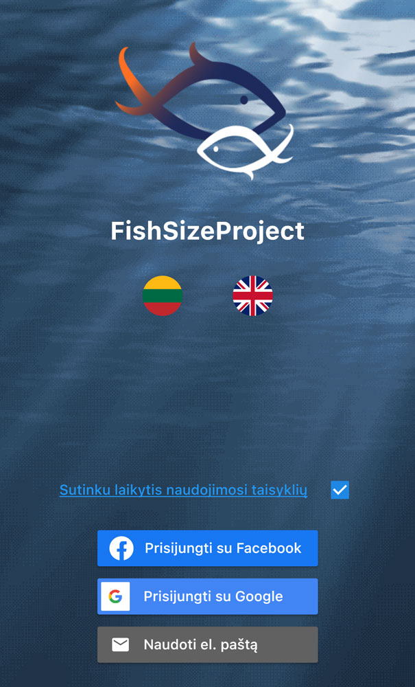

```{r setup, include=FALSE}
knitr::opts_chunk$set(echo = FALSE)

# Learn more about creating websites with Distill at:
# https://rstudio.github.io/distill/website.html

# Learn more about publishing to GitHub Pages at:
# https://rstudio.github.io/distill/publish_website.html#github-pages

```

# WHY THE FISHSIZEPROJECT APP?

FishSizeProject is developed for anglers, divers and everyone who likes observing fish. You will create a log and gallery of your entries and will contribute to important research. FishSizeProject app was developed by scientists at the Nature Research Centre. The app is free, your data will never be used for commercial purposes and we will never reveal your secret fishing spots. Here you can learn more about the data use and privacy.





